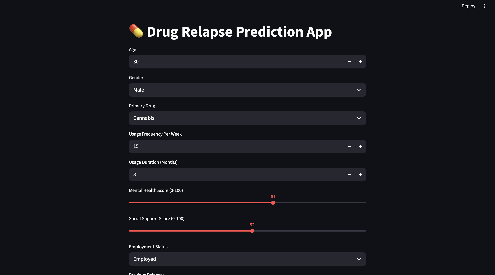
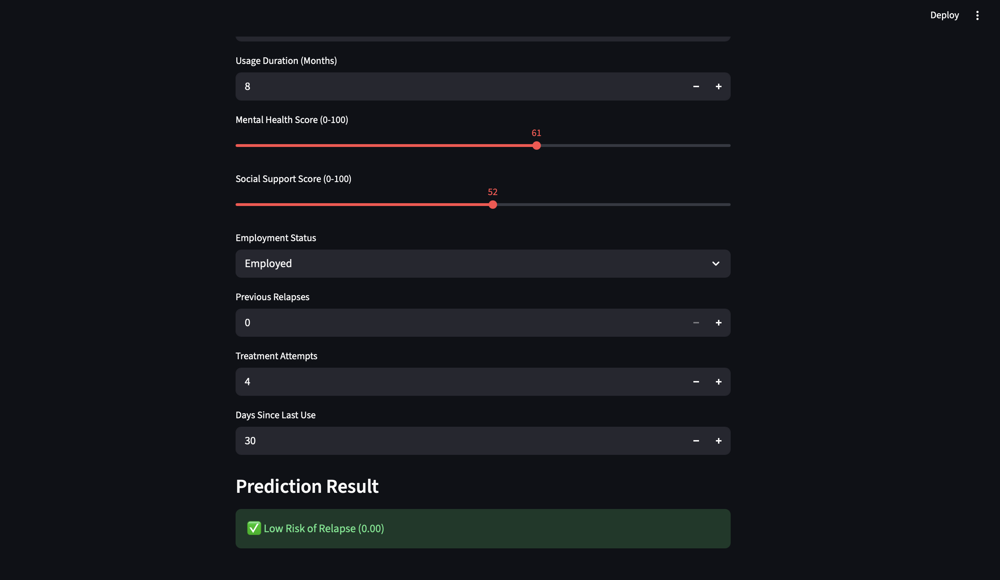

# 💊 Drug Relapse Prediction App

A Machine Learning-based web application that predicts the likelihood of drug relapse based on various behavioral and lifestyle inputs.

---

## 🚀 Overview

This project uses a Deep Learning (LSTM) model to analyze user inputs and predict whether a person is at **Low Risk or High Risk of Relapse**.

The app is built using **Streamlit** for UI and **TensorFlow/Keras** for prediction.

---

## 🎯 Features

- 🧠 ML-based relapse prediction
- 🎛️ Interactive UI with sliders and dropdowns
- ⚡ Real-time prediction
- 📊 Probability score output
- 💻 Runs locally using Streamlit

---

## 📸 Screenshots

### 🧾 Input UI


### 📊 Prediction Output


---

## 🧠 How It Works

1. User enters data
2. Data is preprocessed (encoding + scaling)
3. Input reshaped for LSTM model
4. Model predicts relapse probability
5. Result shown as:
   - ✅ Low Risk
   - ⚠️ High Risk

---

## 🛠️ Tech Stack

- Python
- Streamlit
- TensorFlow / Keras (LSTM)
- Pandas, NumPy
- Scikit-learn

---

## 📂 Project Structure

drug_relapseProject/
│── app.py  
│── train.py  
│── patient_drug_relapse_dataset.csv  
│── drug_relapse_lstm_model.keras  
│── scaler.pkl  
│── label_encoders.pkl  
│── screenshot1.png  
│── screenshot2.png  
│── README.md  

---

## ⚙️ How to Run

```bash
streamlit run app.py# drug_relapseProject
